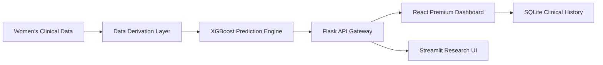

# CardioWise AI: Gender-Specific Cardiovascular Risk Prediction for Women

**CardioWise AI** is a specialized, state-of-the-art clinical decision support system engineered explicitly to address the unique cardiovascular needs of **Women**. By leveraging an **XGBoost machine learning** model trained on clinical vitals, the system identifies high-risk profiles by integrating gender-specific biological markers—such as **Menopause status**, **PCOS indicators**, **Thyroid stress**, and **Pregnancy history**—factors that are frequently overlooked in traditional heart health models.

## 📌 1. The Challenge (Problem Statement)
Cardiovascular disease (CVD) is the **#1 killer of women** globally, yet women are historically underrepresented in heart research. Traditional risk calculators (like ASCVD) often fail to capture the complex hormonal and reproductive transitions that significantly impact a woman's cardiovascular health. 

**CardioWise AI** bridges this gap. It provides a targeted, AI-driven stratification tool that translates complex clinical data into actionable insights, helping healthcare providers identify and intervene in women's heart health earlier and more accurately.

## 🧠 2. The AI Engine (Model & Research)
The core of CardioWise is a high-performance **XGBoost Classifier**, meticulously tuned for high sensitivity in women's risk assessment.

- **Advanced Feature Engineering**: The system automatically derives four critical health indicators:
  - **Menopause Status**: Analyzed based on age-related hormonal transition phases.
  - **PCOS Indicator**: Identified through glucose, activity, and metabolic clusters.
  - **Thyroid Stress Status**: Correlated via systolic pressure and BMI trends.
  - **Pregnancy History**: Integrated as a vital historical risk marker.
- **Explainable AI (XAI)**: Provides transparent "Feature Contribution" reports, showing clinicians exactly which factors (e.g., Blood Pressure vs. Hormonal markers) are driving the risk score.
- **Research Documentation**: Full model evaluation, feature scaling protocols, and training logs are preserved in the `Heart Disease Risk Prediction for Women.ipynb` notebook.

## 🛠️ 3. Technology Stack & Architecture
### **The Core Stack**
- **Machine Learning**: XGBoost, Scikit-Learn, Pandas (The Prediction Core).
- **Backend**: Python, Flask (REST API for real-time inference).
- **Database**: SQLite3 (Secure persistence of clinical history and analytics).
- **Premium Frontend**: React.js 18, CSS3 Modern Glassmorphism (Advanced SaaS UI).
- **Data Dashboard**: Streamlit (Lightweight, rapid-deployment interface).

### **System Architecture**

## 🚀 4. Application Ecosystem
- **🔬 Individual Risk Screening**: Real-time analysis with instant medical advisory generation.
- **📦 Batch Research Intelligence**: Process large patient CSV datasets for population health studies.
- **🩺 Clinical Advisory**: Automated Stage-based Medication (Statins/BP) and Lifestyle protocols.
- **🥗 Precision Nutrition**: BMI-aligned, hormone-supportive Mediterranean diet plans.
- **📈 Analytics Dashboard**: Track department-wide risk distribution and patient outcomes.

## 🚥 5. Deployment & Setup

### **🚀 One-Click Launch (Windows)**
For the fastest setup, double-click **`run_cardiowise.bat`** in the root directory. This script automates environment checks, installs dependencies, and launches all services for you.

- **Live Streamlit App**: [https://cardiowiseai-cq3k7spfk5ukanev47pghf.streamlit.app/](https://cardiowiseai-cq3k7spfk5ukanev47pghf.streamlit.app/)

---
**Medical Disclaimer**: CardioWise AI is designed for educational and clinical screening support. It does not replace professional medical diagnosis. Always consult a board-certified cardiologist.

---
© 2026 CardioWise AI Research. **Advancing Heart Health for Every Woman.**
