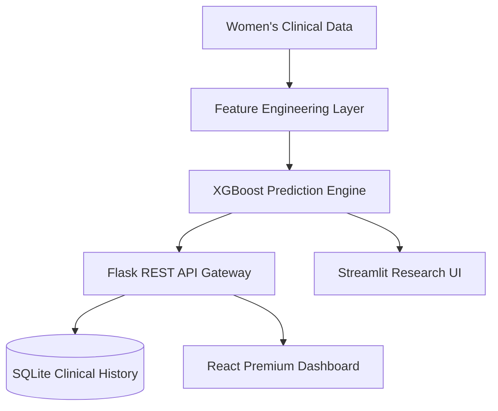
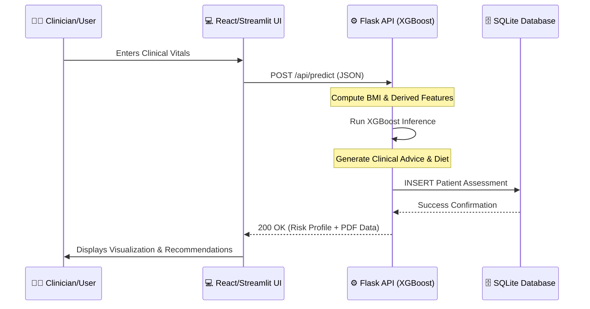

# CardioWise AI: Gender-Specific Cardiovascular Risk Prediction for Women


**CardioWise AI** is a specialized, state-of-the-art clinical decision support system engineered explicitly to address the unique cardiovascular needs of **Women**. By leveraging an **XGBoost machine learning** model trained on clinical vitals, the system identifies high-risk profiles by integrating gender-specific biological markers—such as **Menopause status**, **PCOS indicators**, **Thyroid stress**, and **Pregnancy history**—factors that are frequently overlooked in traditional heart health models.

## 📌 1. The Challenge (Problem Statement)
Cardiovascular disease (CVD) is the **#1 killer of women** globally, yet women are historically underrepresented in heart research. Traditional risk calculators (like ASCVD) often fail to capture the complex hormonal and reproductive transitions that significantly impact a woman's cardiovascular health. 

**CardioWise AI** bridges this gap. It provides a targeted, AI-driven stratification tool that translates complex clinical data into actionable insights, helping healthcare providers identify and intervene in women's heart health earlier and more accurately.

## 🧠 2. The AI Engine (Model & Research)
The core of CardioWise is a high-performance **XGBoost Classifier**, meticulously tuned for high sensitivity in women's risk assessment.

- **Advanced Feature Engineering**: The system automatically derives four critical health indicators:
  - **Menopause Status**: Analyzed based on age-related hormonal transition phases.
  - **PCOS Indicator**: Identified through glucose, activity, and metabolic clusters.
  - **Thyroid Stress Status**: Correlated via systolic pressure and BMI trends.
  - **Pregnancy History**: Integrated as a vital historical risk marker.
- **Explainable AI (XAI)**: Provides transparent "Feature Contribution" reports, showing clinicians exactly which factors (e.g., Blood Pressure vs. Hormonal markers) are driving the risk score.
- **Research Documentation**: Full model evaluation, feature scaling protocols, and training logs are preserved in the `Heart Disease Risk Prediction for Women.ipynb` notebook.

## 🛠️ 3. Technology Stack & Architecture
### **The Core Stack**
- **Machine Learning**: XGBoost, Scikit-Learn, Pandas (The Prediction Core).
- **Backend**: Python, Flask (REST API for real-time inference and history management).
- **Database**: SQLite3 (Secure persistence of clinical history and performance analytics).
- **Premium Frontend**: React.js 18 with Modern Glassmorphism Styling (Advanced Analytics Dashboard).
- **Research UI**: Streamlit (Specialized interface for rapid clinical research and data exploration).

### **System Architecture**


## 🔍 6. Technical Flow & System Architecture

### **Step-by-Step Execution Workflow**
1.  **Data Ingestion**: The User enters clinical vitals (BP, Cholesterol, etc.) and gender-specific factors (Pregnancy, Menopause) via the **React Dashboard** or **Streamlit Research UI**.
2.  **Preprocessing Layer**: The **Flask Backend** receives the JSON payload. It calculates derived features like **BMI** and identifies risk indicators like **PCOS Metabolic Clusters** and **Thyroid Stress** from the raw vitals.
3.  **Hormonal Transformation Logic**: The system maps age and metabolic markers to female-specific risk phases (Pre/Post-Menopause).
4.  **AI Inference**: The processed data is fed into the **XGBoost Classifier**. The model generates a probability score based on the weighted contribution of all 15 clinical features.
5.  **Clinical Advisory Engine**: Based on the risk score and vitals, the backend generates personalized **Medication Stage protocols** (Statins/BP meds) and **Mediterranean Diet** plans.
6.  **Persistence**: The assessment is serialized and stored in the **SQLite Database** (`predictions.db`) for historical tracking.
7.  **Visualization**: The result is sent back to the frontend, rendering interactive **Radar Charts** and **XAI Bar Charts** (Explainable AI) that show exactly which factor drove the risk level.

### **System Flow Diagram**


### **🗄️ Database Schema (`predictions.db`)**
The system uses a highly structured relational schema to ensure clinical data integrity:

| Field | Type | Description |
| :--- | :--- | :--- |
| `id` | INTEGER | Primary Key (Auto-increment) |
| `patient_name` | TEXT | Encrypted or Anonymous Patient Identifier |
| `age/height/weight`| REAL | Basic anthropometric data |
| `ap_hi / ap_lo` | INTEGER | Systolic and Diastolic Blood Pressure |
| `cholesterol/gluc`| INTEGER | Categorical clinical lab levels (1-3) |
| `is_menopausal` | INTEGER | Derived Binary (0/1) for Hormonal Phase |
| `has_pcos` | INTEGER | Derived Binary for Metabolic Indicators |
| `prediction_score` | REAL | Raw risk percentage output from XGBoost |
| `risk_category` | TEXT | Stratification (Low, Moderate, High) |
| `clinical_advice` | TEXT (JSON)| Serialized medication and lifestyle protocols |
| `created_at` | TIMESTAMP | Audit trail of assessments |

---

## 🚀 4. Deployment & Setup

### **Quick Start (Live Deployment)**
Access the specialized clinical research dashboard directly via the live production link:

🚀 **Live Streamlit Platform**: [https://cardiowiseai-cq3k7spfk5ukanev47pghf.streamlit.app/](https://cardiowiseai-cq3k7spfk5ukanev47pghf.streamlit.app/)

### **Local Setup (Development)**
The inclusive **`run_cardiowise.bat`** script automates environment checks and dependency installation if you wish to run the project locally.

1.  Clone the repository.
2.  Double-click **`run_cardiowise.bat`**.

### **Manual Setup**

**Backend:**
```bash
cd backend
pip install -r requirements.txt
python app.py
```

**Frontend:**
```bash
cd frontend
npm install
npm start
```

## 📦 7. Key Features
- **🔬 Individual Risk Screening**: Real-time analysis with instant medical advisory generation.
- **📦 Batch Research Intelligence**: Process large patient datasets via specialized API endpoints.
- **🩺 Clinical Advisory**: Automated Stage-based Medication (Statins/BP) and Lifestyle protocols.
- **🥗 Precision Nutrition**: BMI-aligned, hormone-supportive Mediterranean diet plans.
- **📊 Analytics Dashboard**: Track historical risk distribution and patient outcomes over time.

---
**Medical Disclaimer**: CardioWise AI is designed for educational and clinical screening support. It does not replace professional medical diagnosis. Always consult a board-certified cardiologist.

---
© 2026 CardioWise AI Research. **Advancing Heart Health for Every Woman.**
