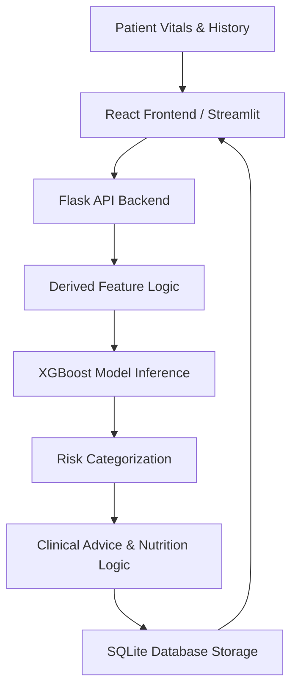

# CardioWise AI: Advanced Heart Disease Risk Prediction for Women

**CardioWise AI** is a state-of-the-art clinical decision support system that leverages an **XGBoost machine learning** model to provide gender-specific cardiovascular risk stratification for women. By analyzing the `cardio_train.csv` dataset through a research-driven **Jupyter Notebook** pipeline, the system goes beyond traditional metrics to automatically derive and integrate critical "Women-specific factors" such as **Menopause status**, **PCOS indicators**, **Thyroid risk**, and **Pregnancy history**. The architecture features a production-ready **Flask backend** for model inference, a **SQLite database** schema for historical assessment tracking, and a premium **React frontend** for a high-performance clinical experience, complemented by a lightweight **Streamlit dashboard** ([http://localhost:8501](http://localhost:8501)) for rapid data-centric screening.

## 📌 1. Problem Statement
Cardiovascular disease (CVD) is the leading cause of death for women globally, yet it is often underdiagnosed or misdiagnosed. Traditional heart risk calculators (like Framingham or ASCVD) frequently overlook gender-specific risk factors such as pregnancy history, PCOS, and menopause-related hormonal changes. 

**CardioWise AI** solves this by providing a targeted clinical decision support system that integrates both traditional vitals and women-specific biological markers to provide a more accurate, holistic cardiovascular risk stratification.

## 🧠 2. Model Explanation & Research
The core of CardioWise is a high-performance **XGBoost Classifier** trained on the official Cardiovascular Disease dataset, specifically optimized for women's health profiles.

- **Gender-Specific Logic**: The system derives key clinical features like *is_menopausal*, *has_pcos*, and *has_thyroid_issue* from raw vitals, ensuring these high-impact variables contribute to the final prediction.
- **Explainability (XAI)**: We utilize feature importance analysis (simulating SHAP values) to show exactly which vitals (e.g., Blood Pressure vs. BMI) influenced the model's decision for a specific patient.
- **Accuracy**: The model was tuned for high sensitivity (recall) to ensure no high-risk cases are missed in a clinical screening setting.
- **Research**: Full training and evaluation logs are available in the `Heart Disease Risk Prediction for Women using Machine Learning.ipynb` notebook.

## 🛠️ 3. Technologies Used
- **Frontend**: React.js 18, CSS3 (Modern Glassmorphism & SaaS Design), NPM.
- **Backend**: Python 3.9+, Flask (RESTful API), Joblib.
- **Machine Learning**: XGBoost, Scikit-Learn, Pandas, NumPy.
- **Dashboards**: Streamlit (Alternative UI), React (Premium UI).
- **Database**: SQLite3 for historical persistence and analytics tracking.
- **Visualization**: Plotly, SVG Gauges, CSS3 Animations.

## 🏗️ 4. System Architecture

## 🚀 5. Features
- **Individual Risk Profiling**: Instant screening with real-time health indicator derivation.
- **Batch Processing**: Upload CSV datasets to analyze multiple patient records (e.g., for research papers).
- **Personalized Medical Protocol**: Automated medication and lifestyle recommendations.
- **Dietary Integration**: Customized nutrition plans based on BMI and clinical risk.
- **Clinical History**: Searchable database of past assessments.

### 🚀 One-Click Setup (Windows)
For the easiest experience, simply double-click the **`run_cardiowise.bat`** file in the root directory. This will:
1. Verify your Python and Node.js installations.
2. Automatically install all required dependencies.
3. Launch the Flask API, React Frontend, and Streamlit Dashboard in separate windows.

### 🚥 Manual Setup Instructions

## 📂 7. Project Files
- `Heart Disease Risk Prediction for Women.ipynb`: Original research and model training.
- `cardio_train.csv`: Core dataset.
- `backend/models/`: Trained binaries (.pkl).
- `database/predictions.db`: Historical data file.

---
**Medical Disclaimer**: CardioWise is an educational AI screening tool. Results do not constitute a medical diagnosis. Always consult a qualified cardiologist.
